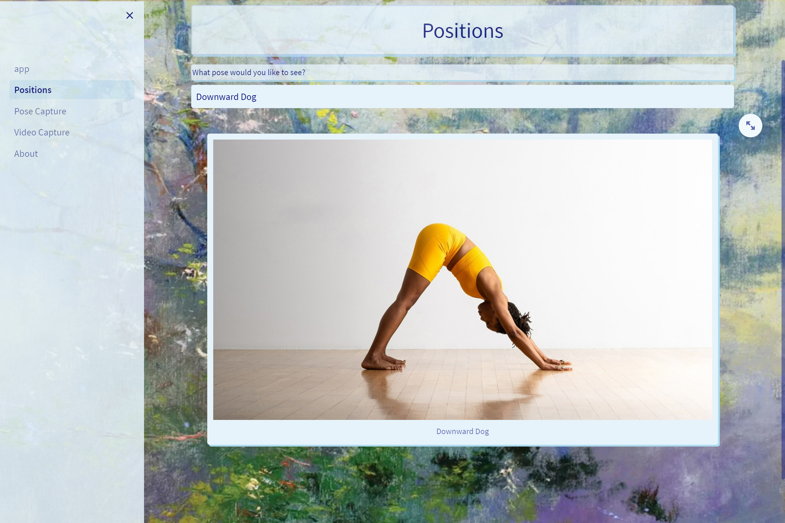
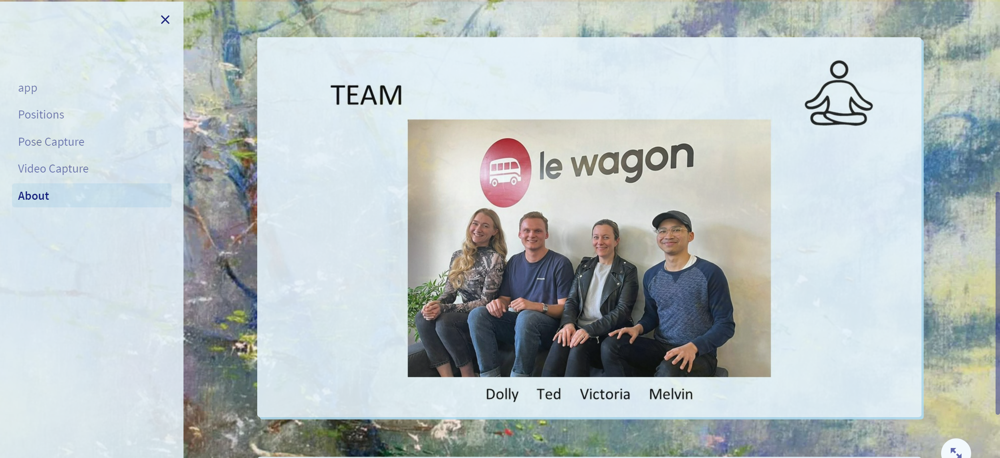
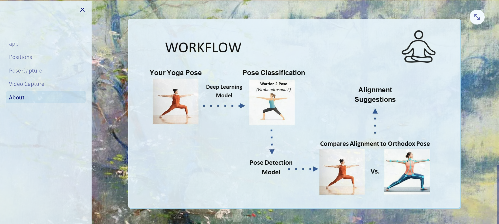
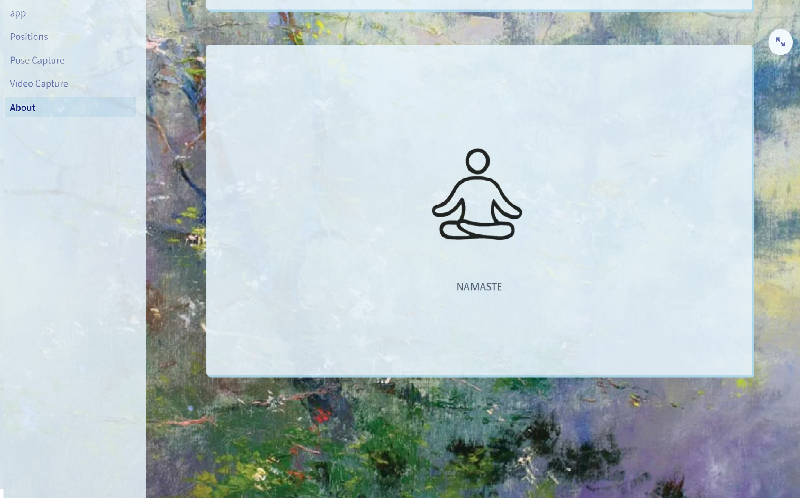

# YOGi :lotus_position:
YOGi Data Science Project

### What was our aim? :raising_hand:
We wanted to create a platform where users could upload images of them doing yoga poses and get instant feedback.

### What technologies did we use? :technologist:

       <a href="https://www.sqlite.org/" target="_blank" rel="noreferrer">  

### Demo :thumbsup:

